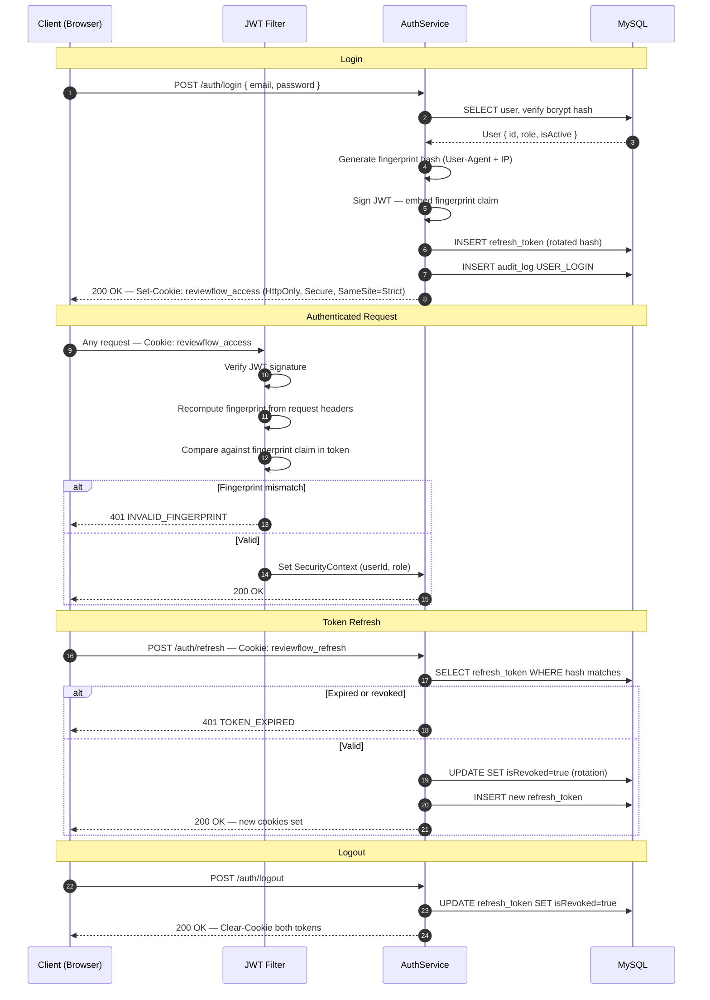
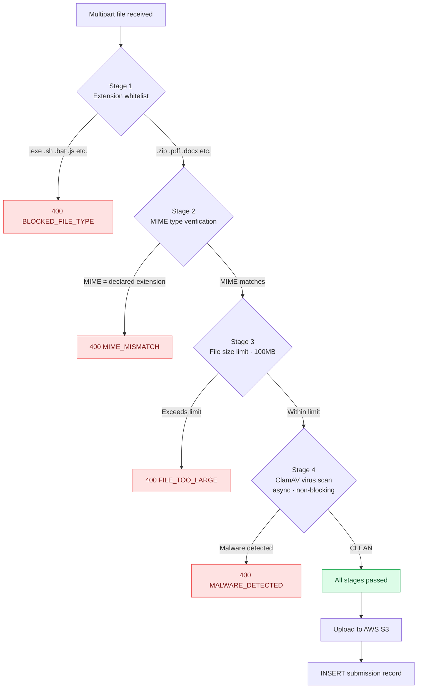
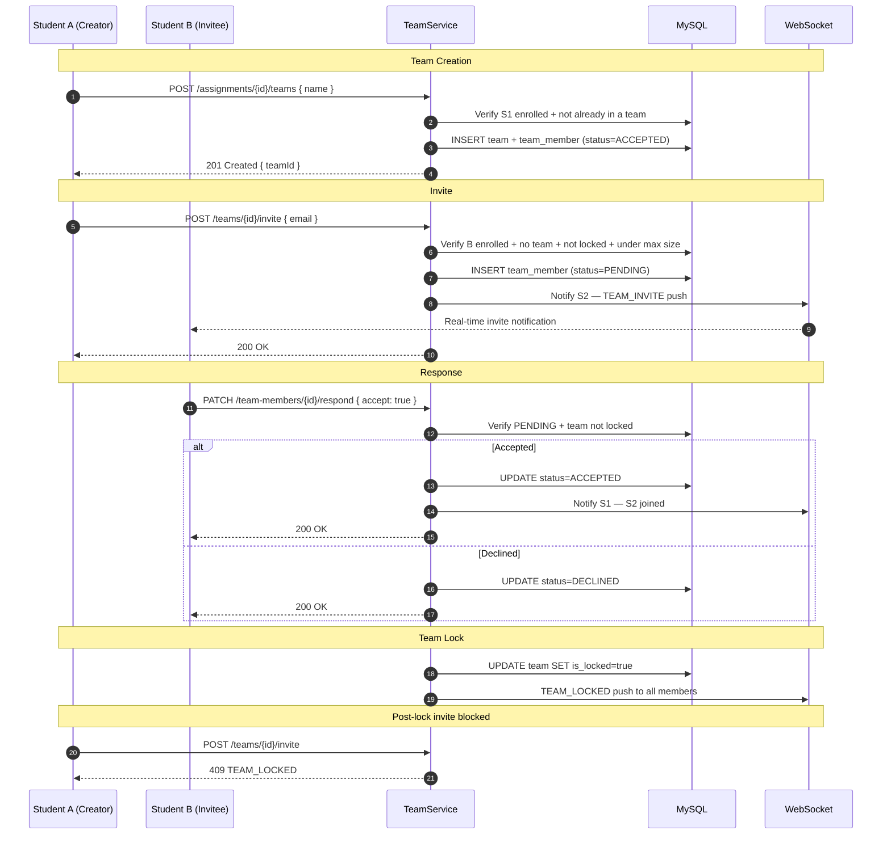
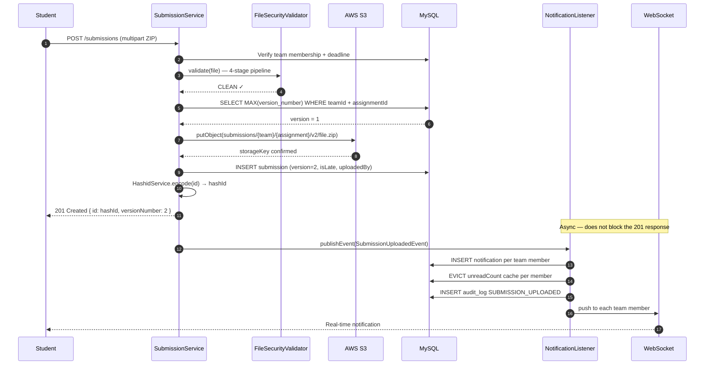
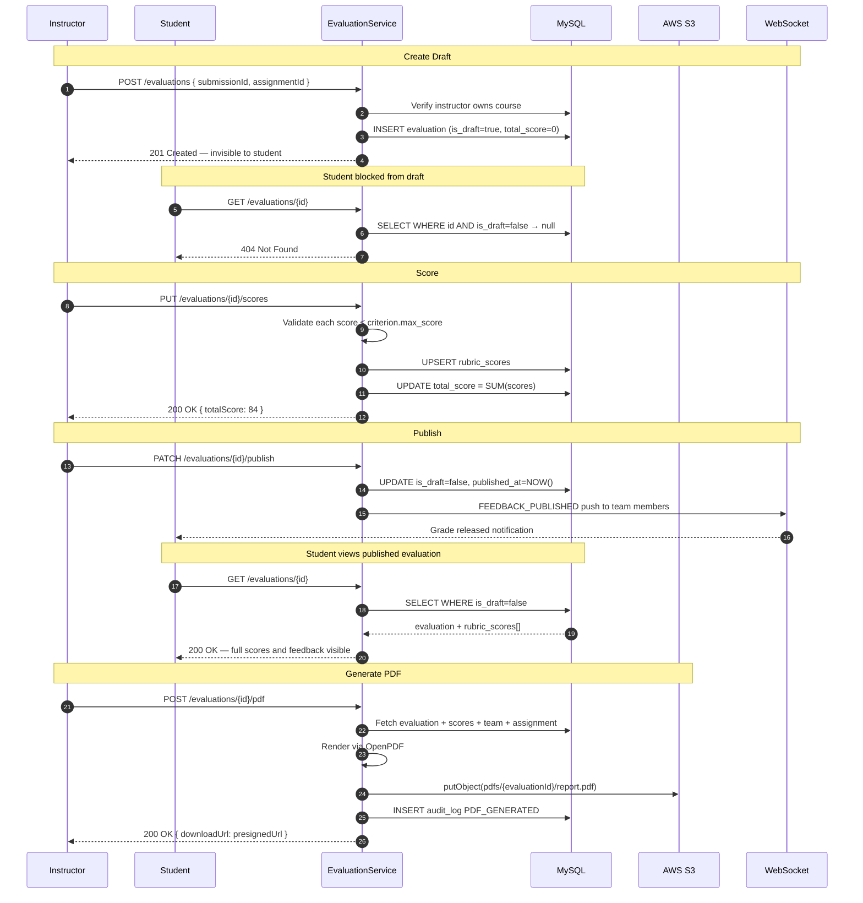
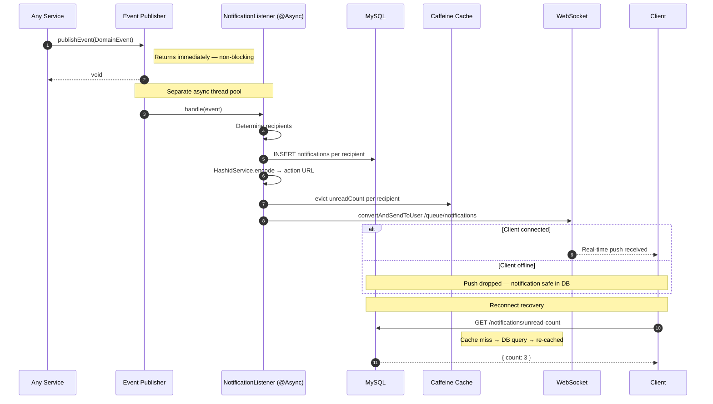

# ReviewFlow — Architecture & System Flows

This document covers all system flows, diagrams, and structural details.  
For the project overview, setup, and API reference see [README.md](./README.md).  
For design decisions and tradeoff reasoning see [DECISIONS.md](./DECISIONS.md).

---

## Contents

1. [Authentication Flow](#1-authentication-flow)
2. [File Security Pipeline](#2-file-security-pipeline)
3. [Team Formation & Invite Flow](#3-team-formation--invite-flow)
4. [Submission Pipeline](#4-submission-pipeline)
5. [Evaluation Pipeline](#5-evaluation-pipeline)
6. [Notification Async Flow](#6-notification-async-flow)
7. [Caching Strategy](#7-caching-strategy)
8. [Security Model](#8-security-model)
9. [Data Model](#9-data-model)
10. [Failure Scenarios](#10-failure-scenarios)
11. [Known Limitations](#11-known-limitations)
12. [Architecture Evolution Path](#12-architecture-evolution-path)

---

## 1. Authentication Flow

<!-- Paste Eraser diagram image URL below -->
> 📌 *Diagram — Authentication Flow*

**How it works:**
- Login verifies the bcrypt password hash, generates a device fingerprint, and sets two HTTP-only cookies — access token and refresh token
- Every authenticated request is fingerprint-validated — a token stolen from another device is rejected at the filter level
- Refresh tokens are single-use — each refresh rotates to a new token and revokes the old one
- Logout revokes the refresh token in the database, invalidating the session server-side

---

## 2. File Security Pipeline

<!-- Paste Eraser diagram image URL below -->
> 📌 *Diagram — File Security Pipeline*

**How it works:**
- Stages run in cheapest-first order — extension check is instant, ClamAV scan is last
- A file that fails any stage is rejected immediately; subsequent stages are not run
- ClamAV runs asynchronously so the validation thread is never blocked waiting for the scan result
- Fail-open in local/dev (ClamAV not required), fail-closed in production (uploads rejected if ClamAV is unavailable)

---

## 3. Team Formation & Invite Flow

<!-- Paste Eraser diagram image URL below -->
> 📌 *Diagram — Team Formation & Invite Flow*

**How it works:**
- Team member status follows a defined lifecycle: `PENDING → ACCEPTED | DECLINED`
- All guard checks run before the `INSERT` — enrollment, existing team, team size, lock status
- Once locked, a team cannot accept new members regardless of size
- Lock can be triggered manually by an instructor or automatically by the scheduler at `team_lock_at`

---

## 4. Submission Pipeline

<!-- Paste Eraser diagram image URL below -->
> 📌 *Diagram — Submission Pipeline*

**How it works:**
- Submissions are versioned — no overwrite, full history preserved per team per assignment
- `isLate` is computed at write time by comparing `uploaded_at` against `assignment.due_at`
- The 201 response returns before async notification processing completes — upload is never delayed by notification delivery
- All external IDs in the response are Hashid-encoded — the raw database integer is never exposed

---

## 5. Evaluation Pipeline

<!-- Paste Eraser diagram image URL below -->
> 📌 *Diagram — Evaluation Pipeline*

**How it works:**
- Draft evaluations return `404` to students — not `403`. Students cannot know an evaluation exists until it is published
- Score validation enforces rubric maximums at write time — invalid scores are rejected before saving
- Publishing is a one-way transition — once published, an evaluation is permanently visible to the team
- PDF is generated on demand, stored in S3, and returned as a pre-signed download URL

---

## 6. Notification Async Flow

<!-- Paste Eraser diagram image URL below -->
> 📌 *Diagram — Notification Async Flow*

**How it works:**
- `publishEvent()` returns immediately — the calling service thread is never blocked by notification logic
- DB write happens before WebSocket push — a notification is never lost because of a delivery failure
- WebSocket delivery is best-effort — if the client is offline, the push is dropped silently
- Clients recover full unread state on reconnect by polling `GET /notifications/unread-count`, which re-hydrates the cache from the database

---

## 7. Caching Strategy

Four Caffeine caches with deliberately chosen TTLs. The abstraction is Spring Cache — replacing Caffeine with Redis requires changing only `CacheConfig`, no annotation changes across any service.

| Cache | TTL | Cache key | Eviction triggers |
|---|---|---|---|
| `adminStats` | 60 s | `'global'` | Any user, course, or submission change |
| `unreadCount` | 30 s | `userId` | Notification create, read, or delete |
| `userCourses` | 5 min | `userId` | Enroll, unenroll, course archive |
| `assignmentDetail` | 10 min | `assignmentId` | Assignment update, rubric change |

Boundaries were chosen deliberately — only data that is read frequently, changes infrequently, and is safe to serve slightly stale qualifies. Write endpoints never cache; they only evict.

---

## 8. Security Model

| Concern | Implementation |
|---|---|
| Authentication | JWT in HTTP-only cookies — XSS cannot read the token |
| Token binding | Fingerprint hash (User-Agent + IP) embedded in JWT — stolen tokens from another device are rejected |
| Token lifetime | Short-lived access token + rotating refresh token — each refresh token is single-use |
| Authorization | STUDENT / INSTRUCTOR / ADMIN enforced at controller and service layers |
| File safety | 4-stage `FileSecurityValidator` — extension, MIME, size, ClamAV |
| ID safety | Hashids on all external IDs — sequential integers never exposed |
| Rate limiting | Per-IP sliding window on auth endpoints |
| Audit trail | Append-only `audit_log` — all significant write actions recorded with actor, IP, and metadata |
| Security headers | `X-Content-Type-Options`, `X-Frame-Options`, `Content-Security-Policy`, `Referrer-Policy` on all responses |

---

## 9. Data Model

14 tables, fully normalized. All schema changes managed through Flyway versioned migrations — `ddl-auto` is never used.

**Core entities:**

| Entity | Notes |
|---|---|
| `users` | Roles: STUDENT, INSTRUCTOR, ADMIN. Soft delete via `is_active` |
| `courses` | Created by instructors, archived not deleted |
| `course_enrollments` | Many-to-many: students ↔ courses |
| `course_instructors` | Many-to-many: instructors ↔ courses |
| `assignments` | Belongs to a course, has publish flag and lock deadline |
| `rubric_criteria` | Per-assignment scoring criteria with `max_score` and `display_order` |
| `teams` | Per-assignment, `is_locked` flag prevents membership changes |
| `team_members` | Status lifecycle: `PENDING → ACCEPTED \| DECLINED` |
| `submissions` | Versioned per team + assignment — no overwrites |
| `evaluations` | Per submission, `is_draft` gate controls student visibility |
| `rubric_scores` | Line-item scores per criterion per evaluation |
| `notifications` | Per user, `related_entity_type` + `related_entity_id` for deep-linking |
| `refresh_tokens` | Hashed, single-use, with `is_revoked` flag |
| `audit_log` | Append-only, actor email + IP + action + metadata |

---

## 10. Failure Scenarios

### Authentication
- Invalid credentials → rate-limited rejection, generic error message (no hint of which field failed)
- Missing or expired JWT → blocked at filter, never reaches a controller
- Fingerprint mismatch → 401, token treated as stolen from another device
- Refresh token reuse → session invalidated (rotation enforced)

### Authorization
- Student requesting a draft evaluation → 404 (existence not revealed, not 403)
- Instructor accessing a course they do not own → 403
- Student accessing another team's submission → 403
- Invite sent to a locked team → 409 TEAM_LOCKED

### File upload
- Blocked extension → 400 BLOCKED_FILE_TYPE (Stage 1 — cheapest check first)
- MIME type mismatch → 400 MIME_MISMATCH (Stage 2)
- File too large → 400 FILE_TOO_LARGE (Stage 3)
- Malware detected → 400 MALWARE_DETECTED (Stage 4)

### Infrastructure
- WebSocket disconnect → notification persists in DB, client recovers on reconnect
- ClamAV unavailable → fail-open locally, fail-closed in production
- S3 upload failure → submission record not persisted (transaction rolled back)
- Notification delivery failure → DB record preserved, never lost

---

## 11. Known Limitations

| Limitation | Reason |
|---|---|
| No distributed transaction management | Monolith scope — all operations share one DB connection and ACID guarantees |
| No global rate limiting across nodes | Per-instance in-memory only — requires Redis before horizontal scale |
| WebSocket requires sticky sessions for multi-node | Needs a Redis broker before horizontal scale is viable |
| Cache is not shared across nodes | In-memory Caffeine — acceptable until horizontal scale is needed |
| No automated grading pipeline | Manual instructor grading only — by design for this phase |

---

## 12. Architecture Evolution Path

ReviewFlow is structured for service extraction. Domain boundaries are already defined — the codebase is organized by domain, not by technical layer. Extraction becomes a matter of deployment topology, not refactoring.

**Services ready for extraction:**

| Service | Extraction trigger |
|---|---|
| `FileService` | Upload throughput needs independent scaling |
| `NotificationService` | WebSocket needs a dedicated broker |
| `EvaluationService` | Grading workflows need independent deployment |
| `AuthService` | SSO or multi-tenant auth is required |

**Infrastructure prerequisites before any extraction:**
- Kafka or RabbitMQ to replace Spring `ApplicationEvent` for cross-service communication
- Redis for distributed cache and WebSocket broker
- API Gateway for routing, auth delegation, and cross-cutting concerns
