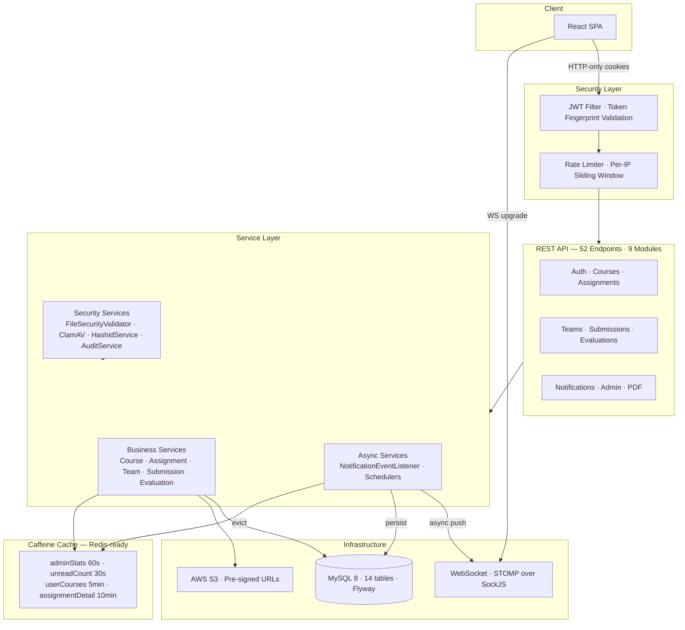

# ReviewFlow

> A university project submission and peer evaluation platform built for real academic workflows — not a toy CRUD app.

**Status:** Backend complete · Frontend in development · Deployment pending

-----

## What It Is

ReviewFlow is a full-stack web application that handles the end-to-end lifecycle of university project submissions: team formation, file submission, rubric-based evaluation, and feedback delivery. Three roles — Student, Instructor, and Admin — each have distinct workflows and permission boundaries enforced at every layer of the stack.

Built as a portfolio project to demonstrate production-grade backend engineering: security hardening, caching strategy, real-time notifications, ID obfuscation, PDF generation, and a multi-stage file validation pipeline — not just CRUD endpoints.

-----

## Tech Stack

|Layer           |Technology                      |Notes                                      |
|----------------|--------------------------------|-------------------------------------------|
|Backend         |Spring Boot 4, Java 21          |                                           |
|Database        |MySQL 8                         |14 tables, Flyway migrations               |
|Auth            |JWT in HTTP-only cookies        |Refresh rotation, token fingerprinting     |
|File storage    |AWS S3                          |Pre-signed URLs                            |
|Real-time       |WebSocket — STOMP over SockJS   |                                           |
|Caching         |Caffeine                        |4 caches, Redis-ready by design            |
|File security   |`FileSecurityValidator` + ClamAV|4-stage pipeline                           |
|ID obfuscation  |Hashids                         |8-char opaque IDs on all external endpoints|
|PDF generation  |OpenPDF                         |Evaluation report export                   |
|API docs        |SpringDoc OpenAPI / Swagger UI  |                                           |
|Containerization|Docker + Docker Compose         |                                           |
|Frontend        |React                           |In development                             |

-----

## Features

### Student

- Enroll in courses and browse published assignments
- Form or join teams — invite teammates, accept or decline invitations
- Upload project submissions (ZIP/PDF) with automatic version tracking
- View rubric-based evaluations and instructor feedback once published
- Download evaluation reports as PDF
- Real-time notifications for invites, new submissions, and published grades

### Instructor

- Create and publish assignments with custom rubric criteria
- Lock teams at a configurable deadline
- Grade team submissions using per-criterion scoring with comments
- Save evaluations as drafts — students see nothing until explicitly published
- Generate and deliver PDF evaluation reports
- Bulk-enroll students into courses

### Admin

- Full user management — create, deactivate, and reactivate accounts
- Platform-wide statistics: users, submissions, storage usage, role breakdown
- Audit log of all significant write actions across the system
- Course and instructor assignment management

-----

## System Architecture



For detailed flow diagrams and architecture breakdowns:

- 📐 [ARCHITECTURE.md](./ARCHITECTURE.md) — all system flows with diagrams and summaries
- 🧠 [DECISIONS.md](./DECISIONS.md) — design decisions and tradeoff reasoning

-----

## API Overview

52 endpoints across 9 modules. Full OpenAPI spec at `/swagger-ui.html` when running locally.

|Module       |Endpoints                                      |
|-------------|-----------------------------------------------|
|Auth         |Login, logout, refresh, `/me`, WebSocket token |
|Courses      |CRUD, enrollment, student roster               |
|Assignments  |CRUD, rubric management, global feed           |
|Teams        |Create, invite, respond, lock, update          |
|Submissions  |Upload, version history, download, student view|
|Evaluations  |Create, score, publish, draft management       |
|PDF          |Generate and download evaluation reports       |
|Notifications|List, mark read, unread count, delete          |
|Admin        |User management, stats, audit log              |

All responses follow a consistent envelope — errors always include a `code` field, never a raw Spring Whitelabel page or stack trace:

```json
{
  "success": true,
  "data": { ... },
  "timestamp": "2026-03-17T14:22:00Z"
}
```

-----

## Project Structure

```
src/main/java/com/reviewflow/
├── config/          # Security, CORS, cache, WebSocket, S3, OpenAPI config
├── controller/      # REST controllers — thin, no business logic
├── service/         # All business logic, caching annotations
├── repository/      # Spring Data JPA interfaces
├── model/           # JPA entities
├── dto/             # Request/response DTOs with Hashid encoding
├── security/        # JWT filter, token fingerprinting, rate limiter
├── event/           # Application events + notification listener
├── exception/       # Global exception handler, custom exceptions
├── scheduler/       # Due-date reminders, token cleanup jobs
└── util/            # HashidService, FileSecurityValidator, ClamAvScanService
```

-----

## Running Locally

### Prerequisites

- Java 21+
- Docker (for MySQL + ClamAV)
- AWS credentials (or LocalStack for local S3)

### 1. Clone and configure

```bash
git clone https://github.com/olafabregas/Reviewflow.git
cd Reviewflow
cp .env.example .env
```

Edit `.env`:

```env
DB_URL=jdbc:mysql://localhost:3306/reviewflow_dev
DB_USERNAME=root
DB_PASSWORD=your_password

JWT_SECRET=your_256bit_secret
HASHIDS_SALT=your_random_salt   # Never change after first run
HASHIDS_MIN_LENGTH=8

AWS_ACCESS_KEY_ID=your_key
AWS_SECRET_ACCESS_KEY=your_secret
AWS_S3_BUCKET=your_bucket
AWS_REGION=us-east-1

CORS_ALLOWED_ORIGINS=http://localhost:5173
```

### 2. Start dependencies

```bash
docker compose up -d mysql clamav
```

### 3. Start the backend

```bash
./mvnw spring-boot:run
```

Flyway migrations run automatically on startup. To seed development data:

```bash
mysql -u root -p reviewflow_dev < src/main/resources/db/seed/seed.sql
```

API: `http://localhost:8081/api/v1`  
Swagger UI: `http://localhost:8081/swagger-ui.html`

### 4. Seed accounts

|Role      |Email                       |Password |
|----------|----------------------------|---------|
|Admin     |admin@university.edu        |Test@1234|
|Instructor|sarah.johnson@university.edu|Test@1234|
|Student   |jane.smith@university.edu   |Test@1234|

36 users · 6 courses · 7 assignments · 40 teams · 21 submissions

-----

## Environment Profiles

|Setting             |Local               |Production                   |
|--------------------|--------------------|-----------------------------|
|ClamAV              |Fail-open (disabled)|Fail-closed (required)       |
|Token fingerprinting|Disabled            |Enabled                      |
|HSTS header         |Off                 |On                           |
|Actuator path       |`/actuator`         |`/internal/actuator`         |
|CORS fallback       |`localhost:5173`    |None — must be set explicitly|

-----

## What’s Next

- [ ] React frontend (15 screens across 3 roles)
- [ ] Docker Compose production config
- [ ] VPS deployment
- [ ] Live demo URL

-----

## About

Built by **Roqeeb Olamide Ayorinde** — a full-stack developer targeting backend-heavy roles.

This project was built to go beyond typical portfolio work: the architecture handles real production concerns (security, caching, real-time, file safety, ID obfuscation) rather than just demonstrating framework familiarity.

- GitHub: [github.com/olafabregas](https://github.com/olafabregas)
- LinkedIn: [linkedin.com/in/roqeeb-olamide-ayorinde](https://www.linkedin.com/in/roqeeb-olamide-ayorinde/)
- Other projects: [ApexWeather](https://apexweather.vercel.app) · [TechTrainers](https://techtrainers.ca)